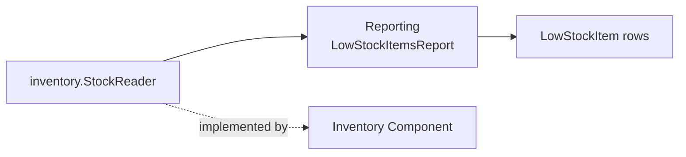

# Lesson 027: Low Stock Items Report

## Objective

Add an operational low-stock report through a narrow Inventory stock-read contract.

## Theory

Inventory has so far been command-oriented: reserve, release, and restock. This lesson adds only the read seam needed for reporting. Inventory provides stock snapshots; Reporting owns the threshold rule and low-stock report shape.

## Why This Matters Here

“Low stock” is a reporting meaning, not an Inventory storage concern. Keeping threshold filtering in Reporting avoids direct map access and prevents infrastructure from deciding business semantics.

## Diagram

## Implementation Focus

- add an Inventory stock snapshot contract
- add threshold filtering and low-stock report rows in Reporting
- add tests and demo output

## What To Verify

- `go test ./...` passes
- items at or below the threshold are included
- the demo renders low-stock output
