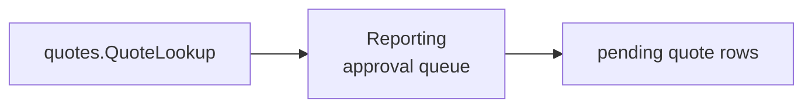

# Lesson 028: Orders Awaiting Approval Report

## Objective

Add an approval-queue projection over pending-approval quotes without inventing a separate order-before-approval model.

## Theory

The current model represents approval work as Quotes in `PendingApproval`. Reporting can present that work as a queue while remaining honest about the underlying component state. It consumes `quotes.QuoteLookup` and calculates queue rows from the published summary shape.

## Why This Matters Here

Operational language does not always match aggregate names. A reporting component can name the workflow users need without bypassing the component that owns the actual state.

## Diagram

## Implementation Focus

- expose quote total amount in the existing read summary
- add a Reporting approval-queue capability over `PendingApproval` quotes
- add tests and demo output

## What To Verify

- `go test ./...` passes
- pending approval quotes appear with line count and total amount
- the demo renders the approval queue
