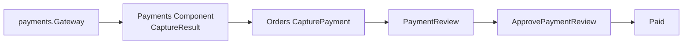

# Lesson 029: Payment Review Workflow

## Objective

Introduce a payment-review outcome so capture can move an order into a business review state instead of only succeeding or failing.

## Theory

Payment gateways can approve immediately, request manual review, or fail technically. Manual review is a business outcome, not a technical error. Payments owns the capture outcome contract; Orders translates that outcome into its own lifecycle.

## Why This Matters Here

The order lifecycle now makes the review branch explicit: `PendingPayment → PaymentReview → Paid`. Shipment remains unavailable until the order is paid, and gateway-specific details stay inside Payments and its adapters.

## Diagram

## Implementation Focus

- add approved/review capture outcomes to Payments
- add `PaymentReview` and `ApprovePaymentReview` to Orders
- keep shipment blocked while an order is under review
- add a manual-review adapter and tests

## What To Verify

- `go test ./...` passes
- capture can move an order to `PaymentReview`
- approving review moves it to `Paid`
- shipment is rejected during review
