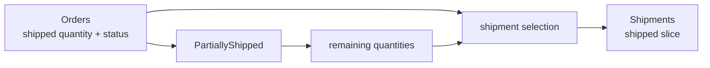

# Lesson 030: Partial Shipment Support

## Objective

Make fulfillment quantity-aware so an order can ship in multiple steps instead of only through an all-or-nothing transition.

## Theory

Orders currently flips from `Paid` to `Shipped` in one operation. Real fulfillment may ship available quantities first and complete the remainder later. Orders therefore tracks shipped quantity per line, while Shipments records each shipped slice.

The lifecycle gains `PartiallyShipped`; an empty selection keeps the existing behavior of shipping all remaining quantities. Cancellation treats a partially shipped order as already in fulfillment and rejects it.

## Why This Matters Here

The new progress state belongs to Orders because Orders owns order lifecycle. Shipments remains responsible only for recording the slice it receives.

## Diagram

## Implementation Focus

- add shipped quantity to order lines and `PartiallyShipped`
- accept explicit shipment selections and default to all remaining
- allow later shipment commands to complete an order
- reject cancellation after partial shipment

## What To Verify

- `go test ./...` passes
- a partial shipment records only requested quantity
- a later shipment completes remaining quantity
- partially shipped orders cannot be cancelled
