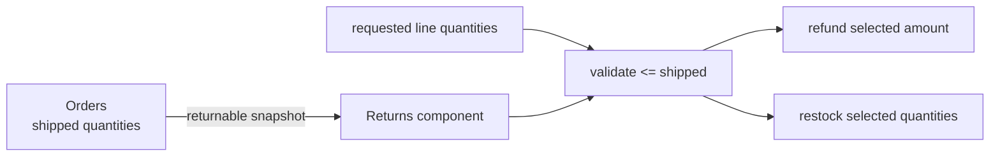

# Lesson 031: Partial Returns by Line

## Objective

Make Returns quantity-aware so a customer can return only part of what an order shipped.

## Theory

Returns should consume the shipped-quantity snapshot owned by Orders. An empty line selection preserves the existing convenience behavior by returning every shipped line, while an explicit selection is validated against each line's shipped quantity. Refund and restock side effects are calculated only from the accepted slice.

## Why This Matters Here

The Returns component owns return intent and review, but it must not invent fulfillment facts. Orders publishes the quantity boundary; Returns applies that boundary to its own workflow and keeps the selected slice in its request snapshot.

## Diagram

## Implementation Focus

- expose shipped quantity in the Orders returnable view
- accept optional return line selections
- reject unknown, zero, or over-shipped quantities
- calculate refund, restock, eligibility, and query details from the selected slice

## What To Verify

- `go test ./...` passes
- a one-of-two return refunds and restocks one unit
- an over-shipped selection is rejected without side effects
- the return query exposes the selected line quantity
