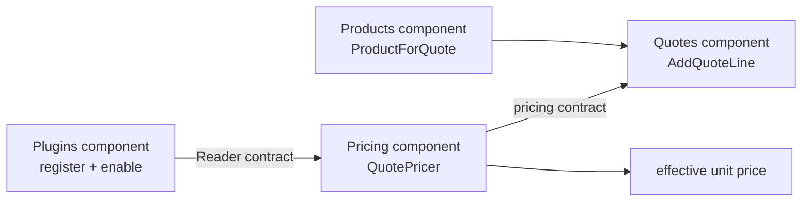

# Lesson 032: Plugin Pricing Extension Point

## Objective

Add a real extension seam so an enabled plugin can change quote-line pricing without changing the Quotes workflow structure.

## Theory

Quotes still owns draft editing and submission, but it should not accumulate a conditional for every pricing experiment. The Plugins component owns registration and enablement state. The Pricing component owns the narrow pricing capability that Quotes consumes through a contract.

The first plugin is deliberately small: `seasonal-pricing` applies a five-percent discount. The quote workflow remains the same; only the enabled plugin set changes the effective unit price.

## Why This Matters Here

Component-based architecture makes optional behavior visible as a component boundary. Without this seam, pricing rules would leak into Quotes or product storage. With it, Plugins owns activation, Pricing composes the behavior, and Quotes remains focused on quote lifecycle.

## Diagram

## Implementation Focus

- register, enable, and list pricing plugins
- expose a pricing contract for quote-line unit prices
- implement `seasonal-pricing` as a plugin-aware pricing component
- make Quotes request the effective price before storing its line snapshot

## What To Verify

- `go test ./...` passes
- a plugin can be registered and enabled
- enabling `seasonal-pricing` changes the stored quote-line unit price
- the demo shows the plugin and pricing impact
