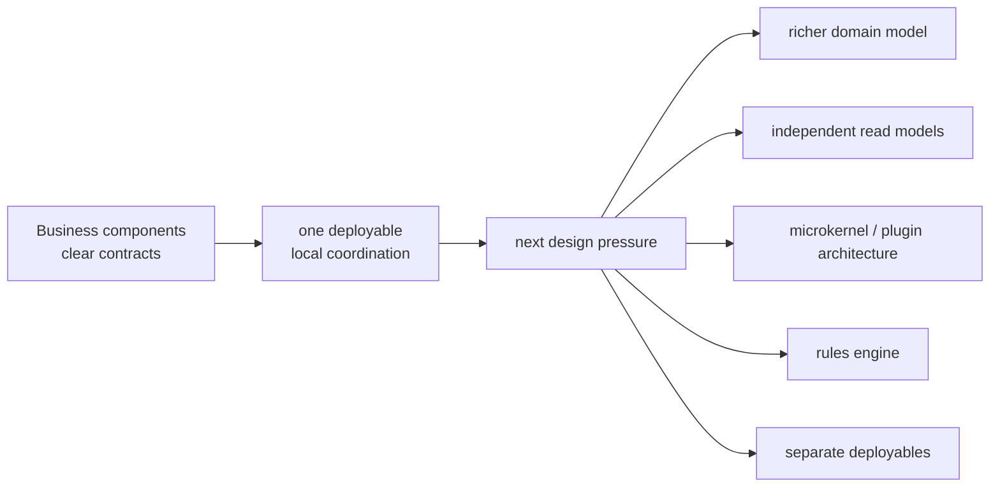

# Lesson 033: Why Not Stop At Component-Based Architecture?

## Objective

Explain what this component-based design handles well and what kinds of pressure could justify moving to a different architecture.

## Short Answer

You absolutely could stop here for many systems.

This track now has explicit business components for customers, products, quotes, orders, shipments, returns, inventory, payments, reporting, plugins, and pricing. Their public contracts make collaboration visible without requiring separate deployables.

The right question is not “Why is component-based architecture insufficient?” It is “Which next pressure would another architecture optimize better?”

## What It Is Good At

- keeping business capabilities together without collapsing them into one giant service
- making public component contracts and dependency direction visible
- growing realistic workflows such as approval, payment review, partial shipment, and partial return
- giving reports and extension points explicit homes
- preserving one process, one deployable, and straightforward local consistency

## The Core Limitation

Components are strong boundaries inside one deployable, but the pattern does not decide how rich the domain should become, how far read models should diverge, how plugins should scale, or when a boundary should leave the process.

The boundaries are also not self-enforcing. A team can still widen contracts, import private implementation details, or move business rules into convenience helpers.

## Diagram

## What Could Justify Moving On

### Richer domain modeling

If aggregates, value objects, and domain language become the main concern, DDD or a rich domain model may provide stronger modeling tools.

### Greater read/write divergence

If dashboards and analytics need independent denormalized stores and projection pipelines, CQRS becomes more attractive.

### Plugins become a primary product capability

If extension lifecycle, isolation, discovery, and third-party governance dominate, Microkernel or Plugin Architecture becomes the deeper focus.

### Rules become numerous or configurable

If policies are authored outside code or need composition and runtime evaluation, a Rules Engine architecture may fit better.

### Boundaries need operational independence

If a capability needs separate scaling, deployment, or failure isolation, a service-oriented decomposition may be justified.

## Why We Are Not Leaving Because It Failed

This architecture has done its job: it demonstrated that business boundaries, realistic workflow growth, reporting, and extension seams can coexist inside one deployable. Other architectures are not automatically better; they optimize for different pressures.

## What To Verify

- all component-based lessons `000` through `033` exist
- the implementation remains green with `go test ./...`
- the final demo still runs
- the repository has a commit and tag for every completed lesson
