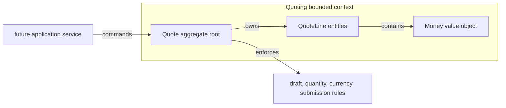

# Lesson 000: Ubiquitous Language And The Quote Aggregate

## Objective

Start the Domain-Driven Design track with a shared vocabulary and a behavior-rich `Quote` aggregate in the Quoting bounded context.

## Theory

DDD begins by modeling the business language, not by choosing tables or handlers. In this lesson, `Quote` means a negotiable pre-order proposal, and it owns the rules for editing, totaling, and submission. `Money` is a value object: callers cannot mutate its amount or currency independently of its invariants.

The aggregate root is the only entry point for changing quote state. That keeps related rules coherent:

- a quote can receive lines only while it is `Draft`
- line quantities must be positive
- a quote cannot be submitted without a line
- all lines use one currency

## Why This Matters Here

The previous Component-Based track emphasized peer components and their contracts. DDD changes the center of gravity to business meaning and consistency boundaries. The first implementation therefore has no repository, HTTP adapter, or generic service layer yet. It makes the domain model explicit before adding coordination around it.

## Diagram

## Implementation Focus

- create a standalone Go module for the DDD track
- model `Money` as an immutable value object
- model `Quote` as an aggregate root with private state and behavior methods
- test the aggregate invariants and demonstrate the lifecycle in a small CLI

Deliberately leave repositories, application services, domain events, and other bounded contexts for later lessons.

## What To Verify

- `go test ./...` passes
- invalid line quantities and mixed currencies are rejected
- an empty quote cannot be submitted
- a submitted quote cannot be edited
- the demo creates, totals, and submits a quote
