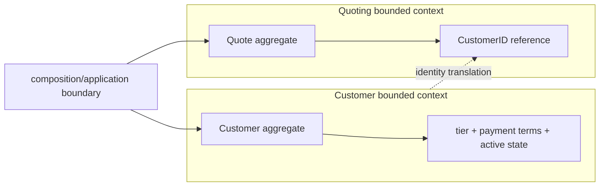

# Lesson 001: Customer Aggregate And Context Boundary

## Objective

Introduce a second bounded-context candidate and show how one aggregate references another without owning its state.

## Theory

The canonical model separates Customer and Quoting concepts. A `Customer` owns customer-specific language such as tier, payment terms, and active status. A `Quote` needs to know which customer it belongs to, but it should not embed or mutate the Customer aggregate.

The boundary is expressed through identity:

- Customer owns its own lifecycle and invariants
- Quote stores a `CustomerID` reference
- coordination between the aggregates belongs to a later application or domain service

This keeps aggregate transactions small and prevents one aggregate from becoming a back door into another aggregate's internals.

## Why This Matters Here

DDD is not only about putting methods on structs. It is also about deciding where a concept's language and consistency rules stop. The Customer and Quoting packages intentionally use separate types, even for their IDs; translating between contexts is explicit at the composition boundary.

## Diagram

## Implementation Focus

- add a Customer aggregate with tier, payment terms, and active/inactive behavior
- keep Customer state private behind aggregate methods
- compose Customer and Quote using an explicit identity translation
- test Customer invariants without introducing repositories or cross-aggregate mutation

Leave cross-aggregate coordination for a later domain or application service lesson.

## What To Verify

- `go test ./...` passes
- invalid customer identity, tier, and payment terms are rejected
- deactivation changes Customer state and repeated deactivation is rejected
- Quote still stores only its customer identity
- the demo creates both aggregates and submits the quote
