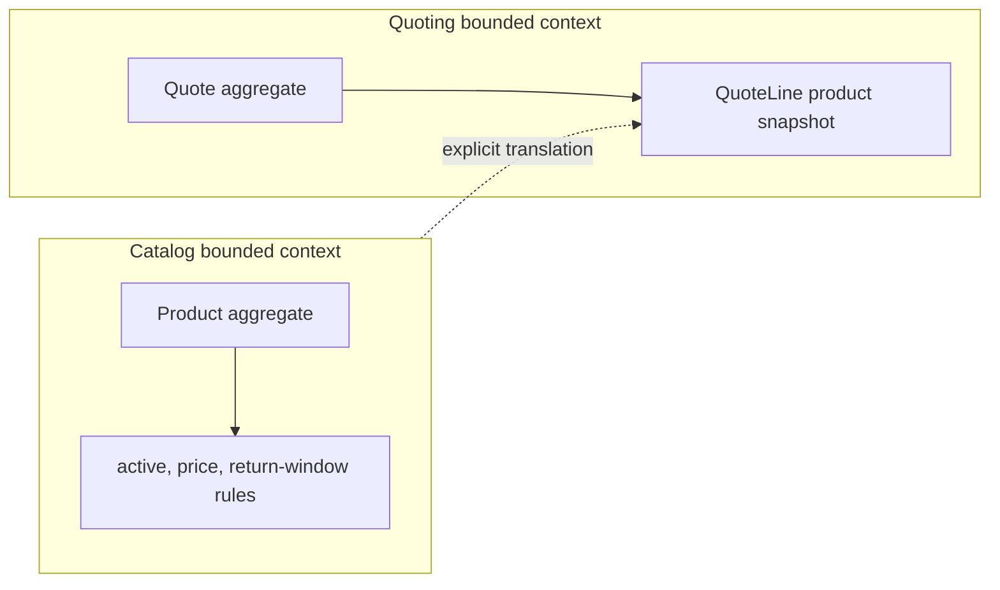

# Lesson 002: Product Aggregate And Catalog Context

## Objective

Add the Catalog bounded context and model Product as an aggregate that owns commercial catalog rules.

## Theory

Product is not merely a row that Quotes reads. In the Catalog context it owns the language and invariants for a sellable item: SKU, name, category, base price, return window, and active status.

When a quote is created, Quoting should take a deliberate snapshot of the product facts it needs. It should not retain a pointer to the Product aggregate or let later catalog changes silently mutate an existing quote.

## Why This Matters Here

DDD separates aggregate ownership from data reuse. The Catalog and Quoting contexts may collaborate, but each keeps its own model. The explicit translation in the demo makes that boundary visible and leaves orchestration for a later application-service lesson.

## Diagram

## Implementation Focus

- add a Product aggregate with private state and lifecycle behavior
- validate catalog classifications, pricing, and return-window invariants
- translate Product data into a QuoteLine at the boundary
- prove later Product changes do not mutate the existing QuoteLine snapshot

Leave product persistence and cross-context application orchestration for later lessons.

## What To Verify

- `go test ./...` passes
- invalid product data is rejected
- inactive products cannot be used for a new quote snapshot
- a product price change does not rewrite an existing quote line
- the demo creates a Product and translates it into a quote
