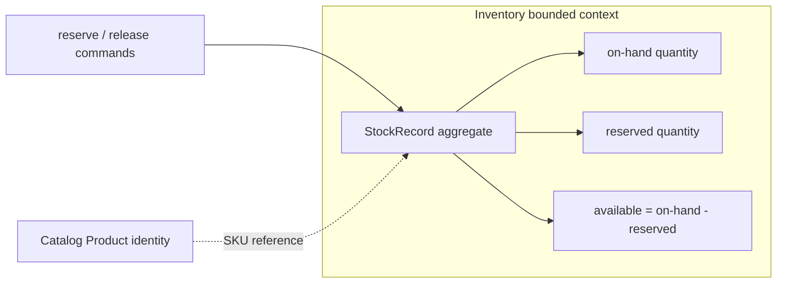

# Lesson 003: StockRecord Aggregate And Inventory Context

## Objective

Model inventory quantity as its own aggregate with explicit reservation and availability invariants.

## Theory

Inventory changes frequently and has a different consistency boundary from Product. The `StockRecord` aggregate therefore owns on-hand quantity, reserved quantity, and the reorder threshold for one SKU.

Its behavior keeps the invariant visible at every mutation:

- on-hand quantity never becomes negative
- reserved quantity never becomes negative or exceeds on-hand quantity
- available quantity is always on-hand minus reserved
- reservation and release are explicit domain operations

## Why This Matters Here

DDD aggregate boundaries are transaction boundaries, not just package folders. Separating StockRecord from Product prevents high-frequency reservation changes from mutating the Catalog aggregate, while still giving later application services a clear domain API to call.

## Diagram

## Implementation Focus

- add the StockRecord aggregate with private quantity state
- implement receive, reserve, and release behavior
- reject mutations that would violate availability or reservation invariants
- expose low-stock evaluation without coupling Inventory to reporting

Leave order conversion and persistence for later lessons.

## What To Verify

- `go test ./...` passes
- reserving reduces available quantity
- releasing returns quantity to availability
- insufficient stock and over-release are rejected
- low-stock status is based on available quantity
