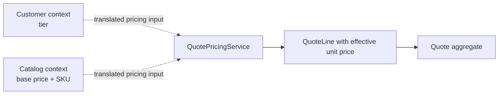

# Lesson 004: Quote Pricing Domain Service

## Objective

Introduce a domain service for pricing behavior that spans facts from the Customer and Catalog contexts without moving those rules into either aggregate.

## Theory

Some behavior does not naturally belong to one aggregate. Quote pricing needs a product's base price and a customer's tier, then produces a QuoteLine for the Quoting context. A `QuotePricingService` is a domain service because the rule is still business behavior, but it is stateless and does not own an aggregate lifecycle.

The service accepts context-local pricing inputs rather than reaching into Customer or Product aggregates. The application boundary can translate external context data into those inputs, while Quote remains responsible for accepting the resulting line and enforcing its own invariants.

## Why This Matters Here

DDD does not mean every rule must be forced into an entity. It means the team chooses a home that preserves the business language and consistency boundary. Keeping tier discounts in a domain service avoids both an anemic Quote and an overly broad Product or Customer aggregate.

## Diagram

## Implementation Focus

- add a Quoting-context pricing input and tier vocabulary
- implement a stateless `QuotePricingService`
- apply Standard, Preferred, and Enterprise discounts
- compose the service with existing aggregates in the demo and tests

Leave persistence, approval policy, and application-service orchestration for later lessons.

## What To Verify

- `go test ./...` passes
- Standard, Preferred, and Enterprise tiers produce deterministic prices
- invalid tiers are rejected
- the Quote aggregate receives the priced line and still owns submission rules
