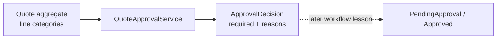

# Lesson 005: Quote Approval Domain Service

## Objective

Evaluate whether a Quote requires approval without moving approval policy into Customer, Product, or the Quote aggregate prematurely.

## Theory

Approval is a business decision derived from the quote's commercial facts. The first rule is canonical: a `CustomBuild` line requires approval. A stateless `QuoteApprovalService` evaluates the Quote and returns a decision with reason codes.

The service does not mutate the Quote and does not perform manager workflow actions. It answers one domain question; a later application service can use that answer to move the aggregate through its approval lifecycle.

## Why This Matters Here

DDD separates decision logic from workflow coordination. The Quote aggregate still owns quote edits and totals, while the domain service owns a cross-cutting policy that may grow to include discount thresholds and other findings.

## Diagram

## Implementation Focus

- preserve product category in the QuoteLine snapshot
- add approval reason and decision types in the Quoting context
- implement a stateless approval domain service
- evaluate CustomBuild lines without mutating Quote state

Leave manager actions, approval persistence, and lifecycle transitions for later lessons.

## What To Verify

- `go test ./...` passes
- standard quotes do not require approval
- a CustomBuild line returns a deterministic reason code
- evaluating approval does not change Quote status or lines
