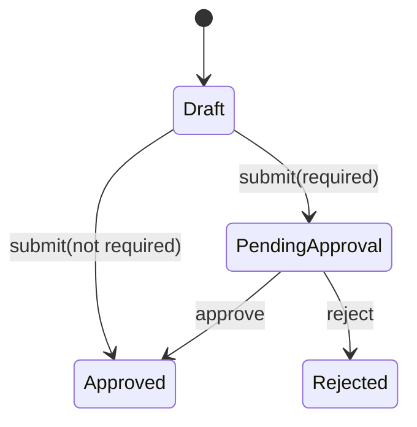

# Lesson 006: Quote Approval Lifecycle

## Objective

Let the Quote aggregate apply an approval decision to its own lifecycle.

## Theory

Lesson 005 answered whether approval is required. This lesson applies that decision inside the Quote aggregate. A draft quote now moves to `PendingApproval` when review is required, or directly to `Approved` when it is not. Only a pending quote can be approved or rejected.

The approval service still decides; the aggregate still owns legal state transitions. Keeping those responsibilities separate prevents policy evaluation from silently changing workflow state.

## Why This Matters Here

DDD makes lifecycle rules part of the aggregate boundary. External code cannot set Quote status directly; it must use methods that preserve the transition rules.

## Diagram

## Implementation Focus

- add approval-aware Quote statuses
- add `SubmitForApproval`, `Approve`, and `Reject` behavior
- reject illegal lifecycle transitions
- update the demo to evaluate and apply approval

Leave approval requests, persistence, and manager actors for later lessons.

## What To Verify

- `go test ./...` passes
- a standard quote becomes Approved on submission
- a CustomBuild quote becomes PendingApproval
- only PendingApproval quotes can be approved or rejected
