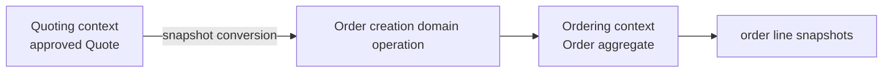

# Lesson 007: Order Aggregate From An Approved Quote

## Objective

Introduce the Ordering bounded context and create an Order aggregate from an approved Quote snapshot.

## Theory

Quote and Order are different business concepts. A Quote is negotiable; an Order is committed. The conversion boundary therefore checks that the Quote is approved, then copies the commercial facts into a new Order aggregate.

The Order does not keep a live pointer to the Quote. Later quote changes cannot rewrite a committed order snapshot.

## Why This Matters Here

DDD bounded contexts use their own models even when concepts are related. The conversion is a domain operation because it protects the rule that only approved commercial terms can become an Order.

## Diagram

## Implementation Focus

- add an Order aggregate with its own status and line snapshots
- require an approved Quote for creation
- translate Quote money and line data into Ordering types
- keep the resulting Order independent from later Quote changes

Leave inventory reservation and payment state for later lessons.

## What To Verify

- `go test ./...` passes
- a draft or pending Quote cannot become an Order
- an approved Quote creates a PendingPayment Order
- Order totals and lines are copied snapshots
