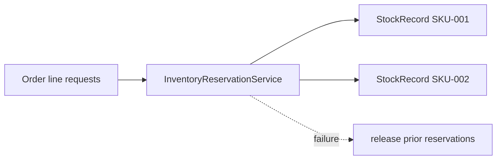

# Lesson 008: Inventory Reservation Domain Service

## Objective

Coordinate reservations across StockRecord aggregates while preserving each aggregate's local invariants.

## Theory

An Order can contain several SKUs, while each StockRecord owns only one SKU's quantities. The `InventoryReservationService` coordinates those aggregates and treats the reservation as one domain operation: if one line cannot be reserved, earlier reservations are released.

The service does not become the owner of stock. StockRecord still decides whether an individual reservation is legal.

## Why This Matters Here

This is a classic DDD domain-service case: the rule spans multiple aggregates but does not belong naturally inside one of them. The service coordinates; the aggregates enforce their own invariants.

## Diagram

## Implementation Focus

- add a reservation request and result vocabulary
- reserve multiple StockRecord aggregates as one operation
- release earlier reservations if a later line fails
- demonstrate reservation coordination during Order creation flow

Leave persistence and backorder policy for later lessons.

## What To Verify

- `go test ./...` passes
- multiple stock records reserve successfully
- a failed line rolls back earlier reservations
- StockRecord remains the owner of per-SKU quantity rules
