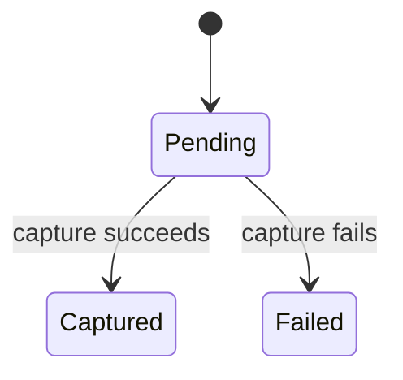
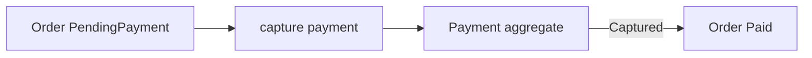

# Lesson 009: Payment Capture Aggregate

## Objective

Model payment capture as a separate aggregate and connect successful capture to the Order payment state.

## Theory

Payment has its own lifecycle and financial facts. It should not be folded into the Order aggregate. A Payment starts `Pending`, then becomes `Captured` or `Failed`; the Order can become `Paid` only after a successful capture.

The two aggregates collaborate through identifiers and explicit domain operations. Payment owns payment status; Order owns order status.

## Why This Matters Here

Separating aggregates keeps financial state changes isolated and makes the consistency rule visible at the coordination boundary instead of creating one oversized Order aggregate.

## Diagram

## Implementation Focus

- add Payment identity, amount, and capture lifecycle
- add Order's Paid state and guarded transition
- demonstrate successful capture across the two aggregates
- keep external gateways for a later adapter lesson

## What To Verify

- `go test ./...` passes
- pending payments can be captured once
- failed or repeated captures are rejected
- an Order cannot be marked Paid from the wrong state
