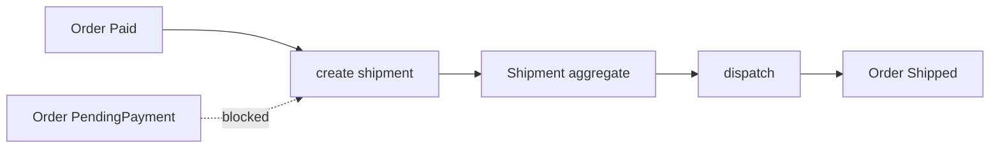

# Lesson 010: Shipment Aggregate After Payment

## Objective

Model shipment as a separate Fulfillment aggregate and require payment before shipment creation.

## Theory

Shipment is a physical fulfillment record, not merely an Order status. It owns shipped line quantities and its own dispatch lifecycle. The Order remains the commercial aggregate and records that fulfillment has started only after a Shipment is dispatched.

The creation rule is explicit: a PendingPayment Order cannot create a Shipment.

## Why This Matters Here

DDD keeps distinct business lifecycles in distinct aggregates. Payment, Order, and Shipment collaborate through guarded operations instead of one aggregate reaching into all of the others.

## Diagram

## Implementation Focus

- add Shipment identity, line snapshots, and dispatch lifecycle
- require a Paid Order for shipment creation
- add the Order Shipped transition
- demonstrate payment → shipment → shipped order flow

Leave partial shipment quantities for a later lesson.

## What To Verify

- `go test ./...` passes
- unpaid Orders cannot create Shipments
- paid Orders create pending Shipments
- dispatch changes Shipment and Order state correctly
