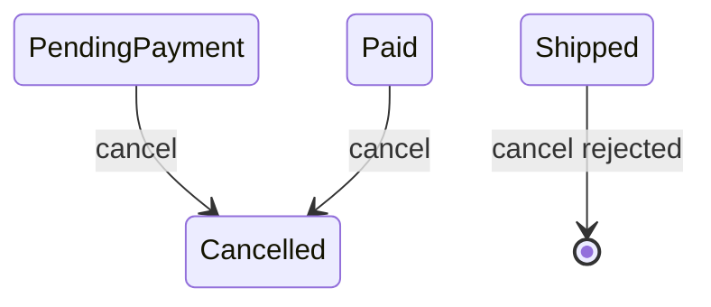

# Lesson 011: Order Cancellation And Reservation Release

## Objective

Add the Order cancellation invariant and make the release responsibility explicit at the coordination boundary.

## Theory

An Order may be cancelled before any shipment, but a shipped Order must use the Returns workflow instead. The Order aggregate owns that lifecycle decision.

Inventory reservations belong to StockRecord aggregates, so cancellation does not secretly mutate stock from inside Order. A later application service can call Inventory release after the Order accepts cancellation.

## Why This Matters Here

DDD keeps aggregate responsibilities narrow. Order decides whether cancellation is legal; Inventory decides whether a reservation can be released. Coordination between them remains visible rather than hidden in one oversized aggregate.

## Diagram

## Implementation Focus

- add Cancelled status and guarded `Cancel` behavior
- reject cancellation after shipment
- test the boundary independently of Inventory
- demonstrate the shipped-order rejection in the demo

Leave the full cancellation application workflow for a later coordination lesson.

## What To Verify

- `go test ./...` passes
- paid orders can be cancelled
- shipped orders cannot be cancelled
- Order cancellation does not directly mutate StockRecord
