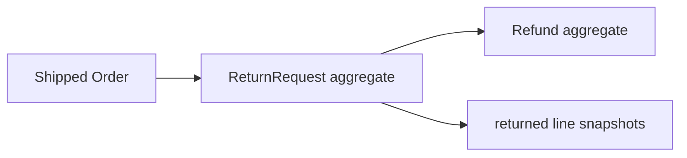

# Lesson 012: ReturnRequest And Refund Aggregates

## Objective

Introduce Returns as its own bounded context with separate return-request and refund lifecycles.

## Theory

A return request records a customer's intent and the shipped lines being returned. A refund records the financial follow-up. They are related, but they have different lifecycles and consistency rules, so they remain separate aggregates linked by identifiers.

The first rule is simple: a return can reference only a Shipped Order.

## Why This Matters Here

DDD avoids collapsing operational and financial workflows into the Order aggregate. Returns can evolve with eligibility, review, restocking, and refund policies without making Order responsible for every concern.

## Diagram

## Implementation Focus

- add ReturnRequest creation from a shipped Order
- add Refund pending/issued lifecycle
- keep both aggregates linked by IDs
- demonstrate a requested return and issued refund

Leave return eligibility, review actors, and restocking for later lessons.

## What To Verify

- `go test ./...` passes
- unshipped Orders cannot create ReturnRequests
- shipped line snapshots are copied into the request
- Refund can be issued only once
