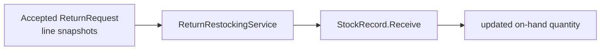

# Lesson 013: Return Restocking Domain Service

## Objective

Restock accepted return lines through Inventory without making Returns own stock state.

## Theory

Returns knows which lines were accepted, while Inventory owns on-hand quantity. A `ReturnRestockingService` translates accepted return lines into Inventory receive operations.

The service coordinates contexts; StockRecord still owns the quantity mutation and its invariants.

## Why This Matters Here

DDD keeps bounded-context ownership clear even when a workflow crosses contexts. Returns does not reach into an Inventory aggregate's fields, and Inventory does not need to know why the goods are being received.

## Diagram

## Implementation Focus

- add restock request vocabulary
- coordinate receiving returned quantities into StockRecord aggregates
- demonstrate refund plus restock after an accepted return
- preserve StockRecord ownership of quantity invariants

Leave partial returns and restock auditing for later lessons.

## What To Verify

- `go test ./...` passes
- accepted return quantities increase on-hand stock
- unknown SKUs and invalid quantities are rejected
- restocking does not alter reserved quantity
