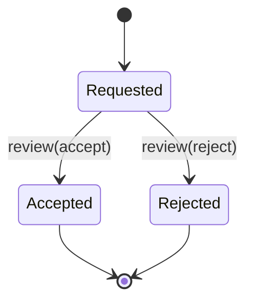

# Lesson 014: Return Review Boundary

## Objective

Make return review an explicit domain decision instead of exposing status mutation.

## Theory

A ReturnRequest begins as customer intent. Review is a separate business moment that produces an accepted or rejected outcome. The aggregate should receive a review decision, validate that the request is still reviewable, and apply the resulting state transition.

Eligibility policy and reviewer identity are deliberately left for later lessons.

## Why This Matters Here

DDD makes important business moments explicit. A review boundary gives later eligibility, actor, and idempotency concerns a stable place without spreading status assignments across callers.

## Diagram

## Implementation Focus

- add review decision vocabulary
- add one guarded Review operation to ReturnRequest
- preserve Accept and Reject as domain-level transitions
- update the demo to use the explicit review boundary

Leave eligibility policy and reviewer metadata for later lessons.

## What To Verify

- `go test ./...` passes
- requested returns can be accepted or rejected
- reviewed returns cannot be reviewed again
- review decisions do not issue refunds automatically
