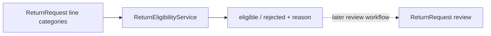

# Lesson 015: Return Eligibility Domain Service

## Objective

Introduce a return-policy domain service that evaluates whether returned product categories are eligible.

## Theory

Return review and return eligibility are different decisions. The `ReturnEligibilityService` evaluates policy facts and returns a decision; it does not mutate ReturnRequest state or issue refunds.

The first policy is canonical: Clearance products cannot be returned.

## Why This Matters Here

Policy logic belongs in an explicit domain service when it does not belong to ReturnRequest itself. That keeps the aggregate focused on intent and review lifecycle while allowing policy rules to grow independently.

## Diagram

## Implementation Focus

- preserve product category on return lines
- add eligibility input and decision types
- reject Clearance lines with a reason code
- keep eligibility evaluation side-effect free

Leave shipment-time windows and review integration for later lessons.

## What To Verify

- `go test ./...` passes
- standard and custom-build lines are eligible
- Clearance lines are rejected
- evaluating eligibility does not mutate ReturnRequest
