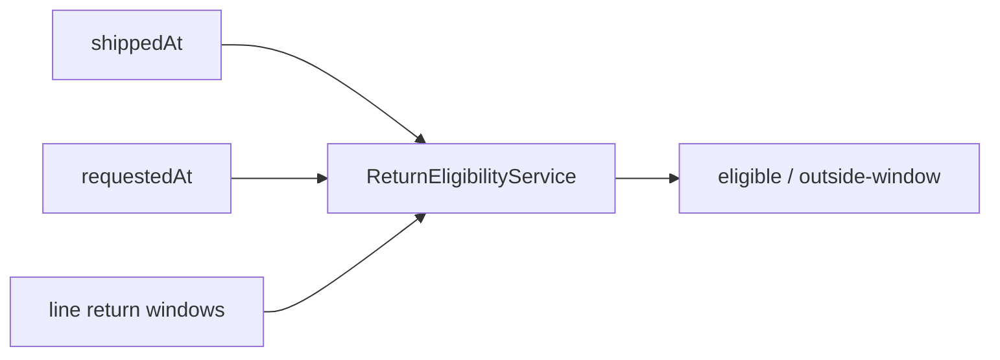

# Lesson 016: Real Return Window Policy

## Objective

Add time-based return eligibility without moving policy calculations into ReturnRequest.

## Theory

Return eligibility depends on both product policy and elapsed time. Each line carries a return window in days. A return is eligible only when the request date is on or before the shipment date plus every line's allowed window.

The policy remains a pure domain decision: it reads timestamps and line facts, then returns an outcome.

## Why This Matters Here

DDD makes temporal business rules explicit and testable. The aggregate can keep its workflow state while the policy service owns date arithmetic and reason codes.

## Diagram

## Implementation Focus

- add return-window days to eligibility inputs
- evaluate shipment and request timestamps
- reject requests outside the allowed window
- preserve Clearance rejection precedence

Leave clock ownership and policy persistence for later lessons.

## What To Verify

- `go test ./...` passes
- requests inside the window are eligible
- requests after the window are rejected
- Clearance remains rejected regardless of date
