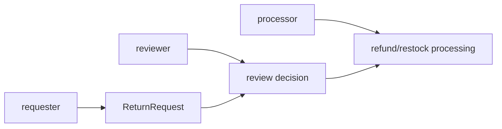

# Lesson 017: Return Actor Metadata

## Objective

Record who requested, reviewed, and processed a return inside the return aggregate.

## Theory

Actor identity is a business fact when the workflow needs accountability. The aggregate stores the identity with the state change, while authentication and identity lookup remain outside the domain.

## Why This Matters Here

Without actor metadata, a return can be accepted or processed but the domain cannot explain who performed those actions. Explicit fields make the audit trail part of the model instead of an accidental log detail.

## Diagram

## Implementation Focus

- require non-empty actor identifiers for workflow actions
- retain requester, reviewer, and processor identities on ReturnRequest
- keep authentication and authorization outside the aggregate

## What To Verify

- `go test ./...` passes
- actor metadata is available after each workflow step
- empty actors and invalid processing states are rejected
