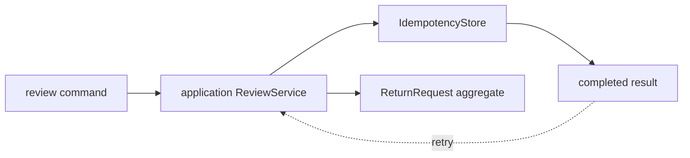

# Lesson 018: Return Command Idempotency

## Objective

Make return review commands safe to retry after a timeout or duplicate submission.

## Theory

Idempotency is an application concern: the application remembers a completed command and returns the same result on a retry. The ReturnRequest aggregate still owns the state transition; it does not need to know how commands are stored or transported.

## Why This Matters Here

Retries are common at system boundaries. Recording the result outside the aggregate prevents a second request from repeating workflow work while keeping the domain model focused on return rules.

## Diagram

## Implementation Focus

- add an application-level idempotency store contract
- save successful review results by caller-supplied key
- replay a saved result without invoking the aggregate again

## What To Verify

- `go test ./...` passes
- the second review with the same key returns the first result
- review commands without a key are rejected
