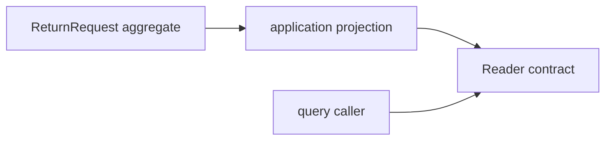

# Lesson 019: Return Query Surface

## Objective

Expose return information through an application read contract rather than leaking aggregate internals.

## Theory

Commands use the aggregate to enforce rules; queries usually need a smaller, read-only shape. An application projection can copy the facts needed by a screen or report while the aggregate remains the owner of workflow behavior.

## Why This Matters Here

Returning the aggregate itself couples callers to domain structure and makes accidental mutation easier. A read model gives callers a stable view without weakening the aggregate boundary.

## Diagram

## Implementation Focus

- define a read-only `Reader` contract
- project return aggregates into details and summaries
- support lookup by id and filtering by status

## What To Verify

- `go test ./...` passes
- callers can read return details without mutating the aggregate
- status filtering works
