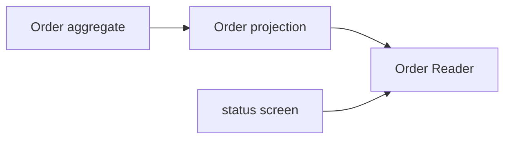

# Lesson 020: Order Query Surface

## Objective

Expose order status and line information through a read-only application contract.

## Theory

An Order aggregate protects transitions such as payment, shipment, and cancellation. A caller that only needs a status should not receive the mutable workflow object. The application can project order facts into a query DTO.

## Why This Matters Here

Keeping order queries separate preserves the aggregate boundary and lets read consumers evolve without adding reporting behavior to the domain model.

## Diagram

## Implementation Focus

- add an order `Reader` contract
- project order identity, customer, status, total, and lines
- support lookup and status filtering

## What To Verify

- `go test ./...` passes
- order details can be queried without exposing aggregate internals
- status filtering returns only matching orders
