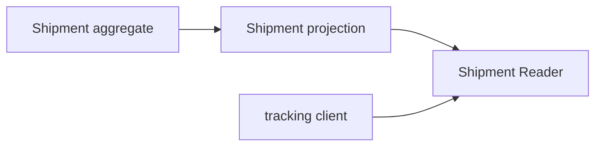

# Lesson 021: Shipment Query Surface

## Objective

Expose shipment progress through a read model without making fulfillment aggregates public state bags.

## Theory

Shipment owns dispatch rules. Consumers usually need tracking facts such as shipment id, order id, status, and line count. A query projection translates those facts into a read-only shape.

## Why This Matters Here

The fulfillment context can change its aggregate implementation while tracking clients keep a narrow, stable contract.

## Diagram

## Implementation Focus

- define shipment details and summaries
- support lookup and status filtering
- copy line data at the read boundary

## What To Verify

- `go test ./...` passes
- dispatched shipments can be queried
- callers receive copied line data
