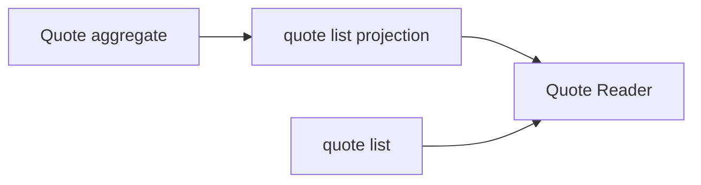

# Lesson 022: Quote List Query Surface

## Objective

Provide a read-only list of quotes without exposing Quote aggregate storage or mutation methods.

## Theory

Quote is a lifecycle aggregate, but list screens need only identity, customer, status, and totals. A query projection can flatten those facts and remain independent from command behavior.

## Why This Matters Here

The read side can add filtering and sorting without turning the domain aggregate into a reporting object.

## Diagram

## Implementation Focus

- define quote details and summaries
- list quotes by lifecycle status
- calculate totals while projecting

## What To Verify

- `go test ./...` passes
- approved quotes appear in the approved list
- the read model does not return mutable Quote values
