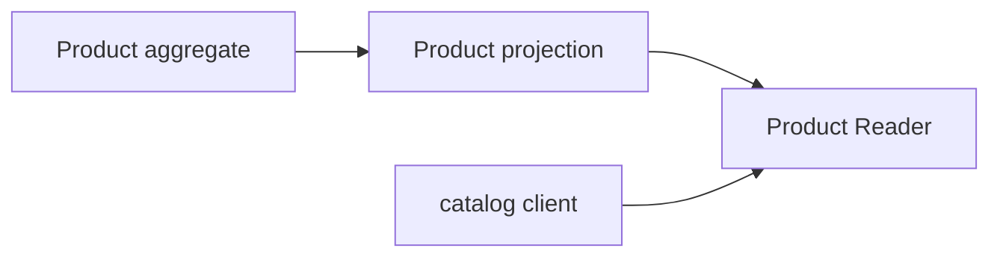

# Lesson 023: Product Query Surface

## Objective

Expose catalog product facts through a stable application read contract.

## Theory

Product is a Catalog aggregate with activation and pricing rules. Search and product-detail screens need descriptive facts, not methods that can change the aggregate. A projection keeps those concerns separate.

## Why This Matters Here

Catalog can evolve its aggregate invariants while consumers keep a small, read-only product view.

## Diagram

## Implementation Focus

- define product details and summaries
- support lookup and active filtering
- expose base price and return-window facts

## What To Verify

- `go test ./...` passes
- active products can be queried
- the read model is independent from Product mutation methods
