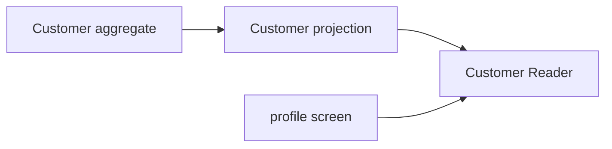

# Lesson 024: Customer Query Surface

## Objective

Expose customer profile facts through a read-only application contract.

## Theory

Customer is an aggregate with tier, payment terms, and activation rules. A profile query should return those facts without giving callers a way to bypass aggregate behavior.

## Why This Matters Here

The application read side can serve profile and account screens while Customer remains the single authority for customer state changes.

## Diagram

## Implementation Focus

- define customer details and summaries
- support lookup and active filtering
- keep profile data immutable at the boundary

## What To Verify

- `go test ./...` passes
- customer profiles can be queried
- inactive filtering excludes deactivated customers
