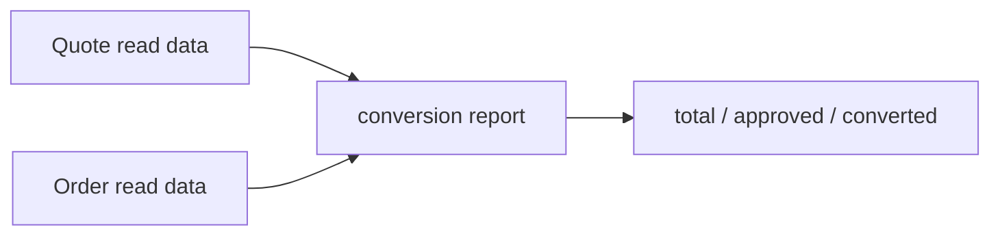

# Lesson 025: Quote Conversion Report

## Objective

Calculate quote conversion metrics from quote and order read data.

## Theory

Conversion is a reporting question, not a new Quote or Order invariant. The application report reads aggregate snapshots and correlates approved quotes with orders created from them.

## Why This Matters Here

Keeping the calculation outside both aggregates avoids putting cross-context analytics into a single domain model.

## Diagram

## Implementation Focus

- count total and approved quotes
- correlate orders to quote ids
- calculate a conversion rate

## What To Verify

- `go test ./...` passes
- converted quotes are counted once
- an empty input reports a zero rate
