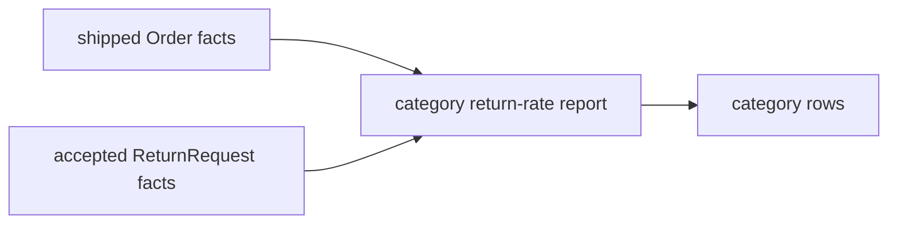

# Lesson 026: Return Rate by Category Report

## Objective

Calculate return rates by product category from shipped orders and accepted returns.

## Theory

Return rate crosses the Ordering and Returns bounded contexts. The report correlates read facts; it does not ask either aggregate to own a metric about the other context.

## Why This Matters Here

Cross-context analytics belong at the application boundary, where translation between each context's types is explicit.

## Diagram

## Implementation Focus

- count shipped quantities by category
- count accepted return quantities by category
- calculate a rate without changing either aggregate

## What To Verify

- `go test ./...` passes
- category rows include shipped and returned quantities
- categories with no returns report a zero rate
