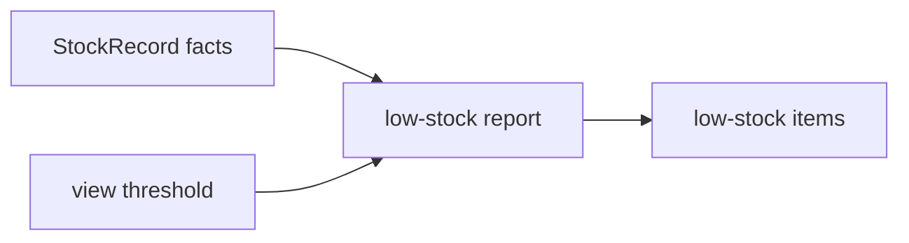

# Lesson 027: Low Stock Items Report

## Objective

Build a low-stock report from Inventory aggregate snapshots.

## Theory

Inventory owns reservation and available-quantity invariants. A report may apply a view-specific threshold to those facts without changing the StockRecord aggregate.

## Why This Matters Here

Operational thresholds and dashboards can change independently from inventory mutation rules.

## Diagram

## Implementation Focus

- read available quantities from stock aggregates
- apply a report threshold
- return stable item rows sorted by SKU

## What To Verify

- `go test ./...` passes
- stock at or below the threshold is included
- stock above it is excluded
