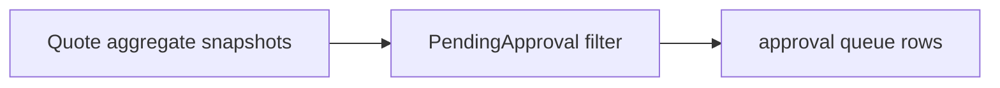

# Lesson 028: Orders Awaiting Approval Report

## Objective

List quotes whose aggregate lifecycle is waiting for approval.

## Theory

The quote aggregate owns the transition to PendingApproval. The report simply selects that state and presents a queue row; it does not reimplement approval rules.

## Why This Matters Here

Operational queues belong in the application/read side while the domain remains the authority for whether a quote is actually approvable.

## Diagram

## Implementation Focus

- select only `PendingApproval` quotes
- project customer, line count, and total
- leave approval decisions to the aggregate and domain service

## What To Verify

- `go test ./...` passes
- pending quotes appear in the queue
- approved quotes are excluded
