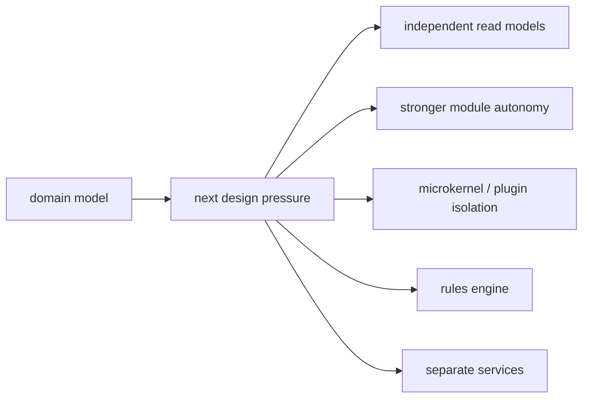

# Lesson 033: Why Not Stop At Domain-Driven Design?

## Objective

Explain what this DDD design handles well and which pressures could justify another architecture.

## Short Answer

You could stop here for many business systems.

This track now has explicit aggregates, value objects, domain services, bounded-context translations, application query surfaces, reports, payment review, partial shipment, partial return, and a pricing policy extension point.

The useful question is not whether DDD is universally sufficient. It is which next pressure matters most for the system.

## What DDD Is Good At

- keeping business language and invariants close to the model
- making aggregate boundaries and context translations explicit
- separating domain decisions from application coordination
- growing realistic workflows without turning every rule into a controller
- giving policies and reports clear homes outside aggregate state changes

## The Core Limitation

DDD does not decide how read models should scale, how plugins should be isolated, how rules should be authored, or when a bounded context should become a separate deployable. It also costs more modeling effort and discipline than a simpler architecture.

## Diagram

## When To Continue Comparing

### Independent reads matter more

If dashboards need their own storage and projection pipeline, CQRS is a stronger next focus.

### Internal module autonomy matters more

If bounded contexts need stricter ownership inside one deployable, a modular monolith may add useful enforcement.

### Extensions become the product

If third parties need discovery, isolation, versioning, and lifecycle management, Microkernel or Plugin Architecture goes deeper.

### Rules become configurable

If policies are authored outside code or composed at runtime, a Rules Engine may fit better.

### Deployment independence matters

If a context needs separate scaling or failure isolation, service-oriented decomposition may be justified.

## Why We Are Not Moving On Because DDD Failed

DDD has done its job here: it made business meaning, invariants, aggregate boundaries, and context translation visible. Other architectures are not automatically better; they optimize for different pressures.

## What To Verify

- lessons `000` through `033` exist
- `go test ./...` passes from this module
- the demo still runs
- every lesson has a matching commit and tag
