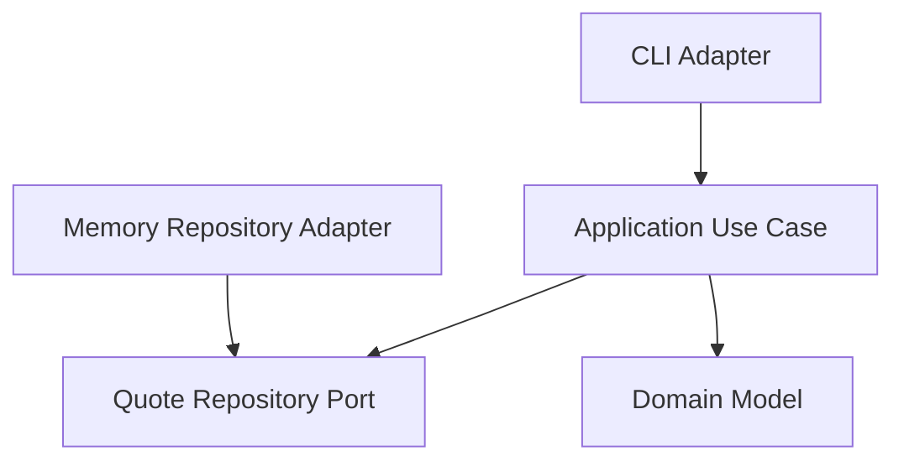

# Lesson 001: Ports And Adapters Skeleton

## Objective

Build the first runnable slice of the application in Hexagonal Architecture so the dependency direction is visible from the start.

## Theory

Hexagonal Architecture starts from a different question than layered architecture.

Instead of organizing the system mainly by technical layers, it asks:

- what is the core application logic?
- what does the core need from the outside world?
- how do outside technologies plug into the core without owning it?

The key idea is dependency inversion:

- the core defines ports
- adapters implement or use those ports
- infrastructure depends on the core
- the core does not depend on infrastructure

This solves a common problem in layered systems where application code slowly becomes shaped by the database, HTTP framework, or CLI transport.

The tradeoff is more indirection earlier. Even a small example needs explicit ports and adapters.

## Why This Matters Here

For this project, Hexagonal Architecture gives us a better baseline for comparing:

- how use cases are isolated from transport and storage
- where dependency inversion becomes explicit
- how easy it is to swap adapters later

## Diagram

## Implementation Focus

Implement:

- a domain `Quote`
- an inbound use case for creating a draft quote
- an outbound repository port
- a memory repository adapter
- a CLI adapter that invokes the use case

Do not add HTTP, approval, inventory, or pricing yet.

## What To Verify

- the project compiles
- the CLI adapter can create a draft quote
- the core use case depends only on ports and domain code
- the memory repository is replaceable without changing the core
