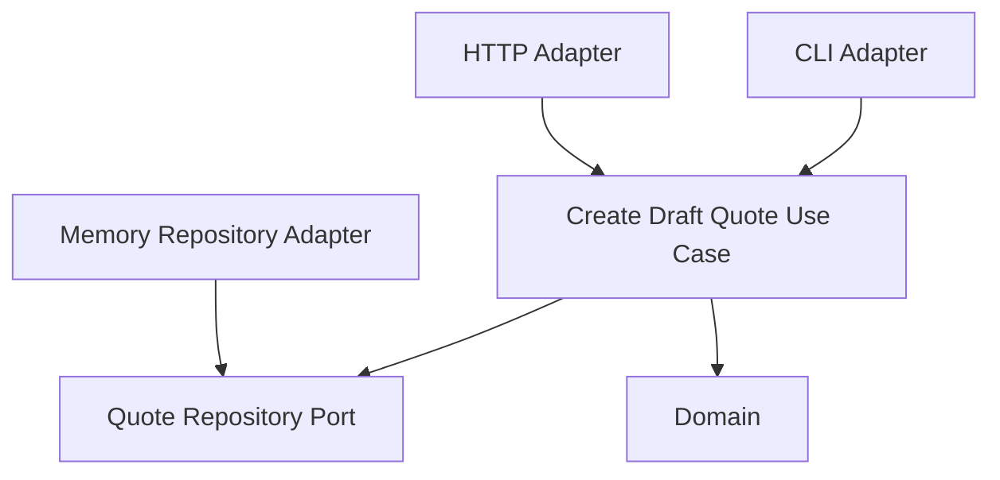

# Lesson 002: Second Inbound Adapter

## Objective

Add an HTTP adapter that drives the same core use case as the CLI adapter.

## Theory

This is the first point where Hexagonal Architecture should start to feel different from a layered design.

The core use case already knows how to create a draft quote. The question now is:

- can a different way of entering the system reuse the same core logic unchanged?

In Hexagonal Architecture, the answer should be yes.

The inbound adapter is responsible for:

- receiving input from the outside world
- translating that input into the shape the core understands
- calling the use case
- translating the result back into transport-specific output

The use case should not need to know whether it was called by:

- a CLI
- an HTTP request
- a test
- a message consumer

This solves the problem where the core slowly becomes shaped by one transport.

The tradeoff is more adapter code at the edge, even when the core behavior stays identical.

## Why This Matters Here

If the layered and hexagonal examples still feel similar, this lesson is one of the first places the difference should become clearer.

The important point is not "we added HTTP."

The important point is:

"We added HTTP without changing the core use case."

## Diagram

## Implementation Focus

Implement:

- an HTTP adapter for creating a draft quote
- tests for the HTTP adapter

Do not add HTTP-specific logic to the core.

## What To Verify

- the project compiles
- the CLI adapter still works unchanged
- the HTTP adapter can create a draft quote
- the core application code does not change to support the new transport
