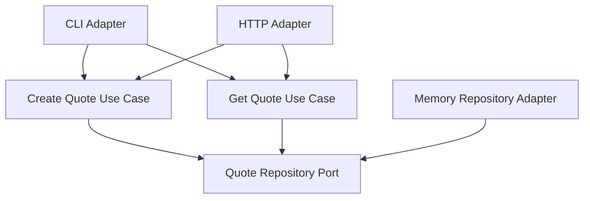

# Lesson 003: Second Outbound Port Operation

## Objective

Extend the repository port beyond a single write operation by adding quote lookup and a read-side use case.

## Theory

So far, the core only depended on one outbound operation:

- save a quote

That proves the basic port pattern, but it does not yet show what happens when the core needs richer collaboration with the outside world.

Hexagonal Architecture becomes more interesting when the core says:

- I need to persist this
- I also need to retrieve this

The important point is that the core still defines the contract. The adapter implements it.

This solves the problem where reads would otherwise leak into adapters without becoming explicit application use cases.

The tradeoff is a broader port contract and more use-case code in the core.

## Why This Matters Here

This lesson makes the first outbound port more realistic and also sharpens the difference between:

- the core use case contract
- the adapter implementation

The repository is still just one adapter, but the core is now shaping more of what it expects from the outside world.

## Diagram

## Implementation Focus

Implement:

- `FindByID` on the repository port
- a `GetQuote` use case in the core
- adapter support for reading an existing quote
- HTTP `GET /quotes/{id}`

## What To Verify

- the project compiles
- a created quote can be loaded through the core use case
- the memory adapter satisfies the richer port
- HTTP can create and then fetch a quote
