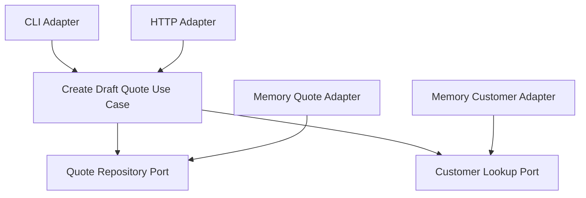

# Lesson 004: Second Outbound Port For Customer Lookup

## Objective

Add a customer lookup port so the core use case depends on more than quote persistence alone.

## Theory

Up to now, the core only needed one kind of external help:

- store and retrieve quotes

That still leaves a fair question:

"Is this really different from just using repository interfaces in a layered design?"

This lesson starts to sharpen the difference.

The core use case now needs two distinct external capabilities:

- quote persistence
- customer lookup and validation

Those are not the same dependency, and the core should say so explicitly through separate outbound ports.

This solves the problem where the core would otherwise create quotes for arbitrary customer IDs without checking any business preconditions.

The tradeoff is more ports and more adapter wiring, but that is exactly how Hexagonal Architecture makes external dependencies visible instead of implicit.

## Why This Matters Here

The important change is not "we added customers."

The important change is:

"The core use case now declares a second external dependency through its own port."

That is a stronger hexagonal signal than a single persistence abstraction.

## Diagram

## Implementation Focus

Implement:

- a customer model in the core
- a customer lookup port
- active-customer validation inside `CreateDraftQuote`
- a memory customer adapter used by the demo and tests

## What To Verify

- the project compiles
- quote creation requires an existing active customer
- the core use case depends on two outbound ports
- adapters satisfy those ports without changing the core
