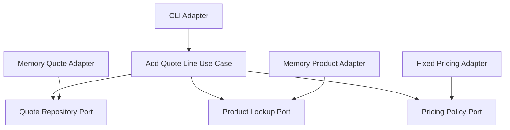

# Lesson 005: Add Quote Line With Multiple Ports

## Objective

Add a quote-line use case that depends on multiple outbound ports instead of just a single repository port.

## Theory

This is one of the places where Hexagonal Architecture should start to feel more distinct.

Creating a draft quote only needed:

- customer validation
- quote persistence

Adding a quote line is more interesting because the core now needs several different external capabilities:

- load the quote
- load the product
- calculate a price
- save the updated quote

The point is not that these are interfaces.

The point is that the core explicitly defines separate ports for separate kinds of outside help.

That means the use case describes the business collaboration it needs without depending on:

- a database package
- an HTTP package
- a concrete pricing implementation

This solves the problem where richer workflows would otherwise collapse into one big service shaped by whatever infrastructure happens to exist.

The tradeoff is more ports, more adapters, and more wiring. That is the cost of making dependencies explicit.

## Why This Matters Here

If the earlier hexagonal lessons still felt close to layered architecture, this lesson should sharpen the difference.

The core use case is no longer just "save a thing."

It is now orchestrating several external capabilities through separate ports.

## Diagram

## Implementation Focus

Implement:

- `Product` and `QuoteLine` in the core
- a `ProductLookup` outbound port
- a `PricingPolicy` outbound port
- an `AddQuoteLine` use case
- one memory product adapter
- one simple pricing adapter

## What To Verify

- the project compiles
- a quote line can be added through the core use case
- the core use case depends on multiple explicit ports
- the resulting quote contains product and pricing data
