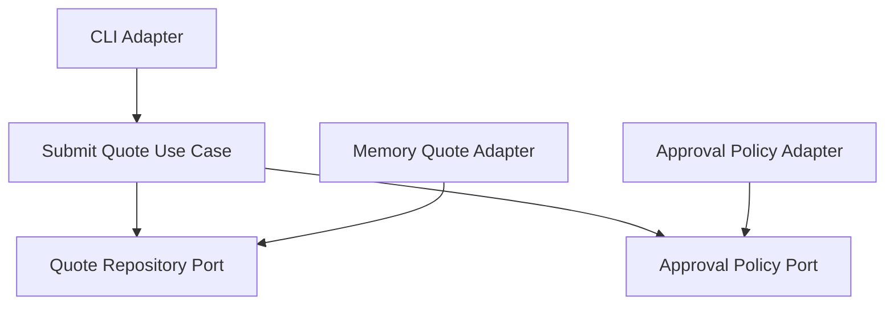

# Lesson 006: Submission And Approval Policy Port

## Objective

Add quote submission and approval, with the submission outcome driven by an explicit approval policy port.

## Theory

This lesson is important because it pushes the core beyond repository-style contracts.

The core now needs an answer to a business question:

- does this quote require approval?

That is not a persistence concern.
That is not a transport concern.
That is a policy concern.

In Hexagonal Architecture, the core can still ask that question through a port.

This is one of the big clarifying moments:

- ports are not only repositories
- ports are any external capability the core needs but does not want to own concretely

This solves the problem where policy decisions get quietly buried in infrastructure or in large procedural services.

The tradeoff is one more abstraction and one more adapter, but the benefit is a clearer separation between:

- workflow orchestration in the core
- policy implementation at the edge

## Why This Matters Here

This lesson should make the hexagonal difference much easier to see.

The core is no longer just saving and loading data. It is orchestrating business flow through:

- persistence ports
- lookup ports
- pricing ports
- approval policy ports

That is a stronger example of "the core owns the contracts."

## Diagram

## Implementation Focus

Implement:

- quote submission states
- quote approval behavior
- an `ApprovalPolicy` port
- a simple adapter that requires approval for `CustomBuild`

## What To Verify

- the project compiles
- standard quotes become approved on submission
- `CustomBuild` quotes become pending approval
- a pending quote can be approved through a core use case
