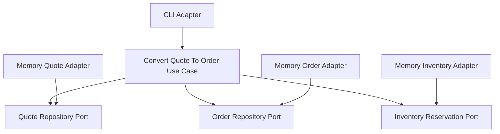

# Lesson 007: Quote To Order With Reservation Port

## Objective

Convert an approved quote into an order by orchestrating explicit order persistence and inventory reservation ports.

## Theory

This is one of the first genuinely workflow-heavy use cases in the hexagonal track.

The core now has to coordinate several things:

- load the quote
- verify it is approved
- reserve inventory
- create an order
- save the order

That is important because it makes the role of the core clearer.

The core is not a controller.
It is not a repository.
It is not a database service.

It is the place where the business workflow is orchestrated using ports.

This solves the problem where complex workflows would otherwise be spread across infrastructure or procedural service layers without a strong central contract.

The tradeoff is more ports, more adapter wiring, and more coordination code in the core.

## Why This Matters Here

This lesson is where Hexagonal Architecture should start feeling decisively different from “just repository interfaces.”

The core is now depending on:

- a quote repository port
- an order repository port
- an inventory reservation port

Those are three different external capabilities, all owned as contracts by the core.

## Diagram

## Implementation Focus

Implement:

- an `Order` model in the core
- an `OrderRepository` port
- an `InventoryReservation` port
- a `ConvertQuoteToOrder` use case
- memory adapters for order storage and stock reservation

## What To Verify

- the project compiles
- only approved quotes convert to orders
- conversion reserves inventory through a port
- the created order snapshots quote lines
