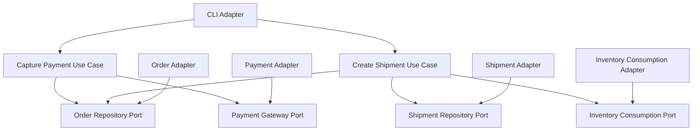

# Lesson 008: Payment And Shipment Ports

## Objective

Add payment capture and shipment creation through explicit ports so the order workflow continues through the core instead of stopping at conversion.

## Theory

At this point, the core can:

- create a quote
- add lines
- submit it
- approve it
- convert it to an order

The next business question is:

- can the order move forward to fulfillment?

That requires two different kinds of external capability:

- payment handling
- stock consumption during shipment

These are useful because they are not just repositories.

The core is now asking external collaborators to:

- accept payment
- consume reserved stock
- persist updated order state

This solves the problem where workflow after order creation would otherwise get pushed into infrastructure scripts or giant services.

The tradeoff is more ports and more use cases, but the workflow remains explicit and testable inside the core.

## Why This Matters Here

This lesson strengthens the central hexagonal idea:

the core orchestrates business workflow and defines contracts for outside capabilities, even when those capabilities are not simple data stores.

## Diagram

## Implementation Focus

Implement:

- payment state on orders
- shipment model
- payment gateway port
- shipment repository port
- inventory consumption port
- capture-payment and create-shipment use cases

## What To Verify

- the project compiles
- payment capture moves the order forward
- shipment requires a paid order
- shipment consumes reserved inventory through a port
