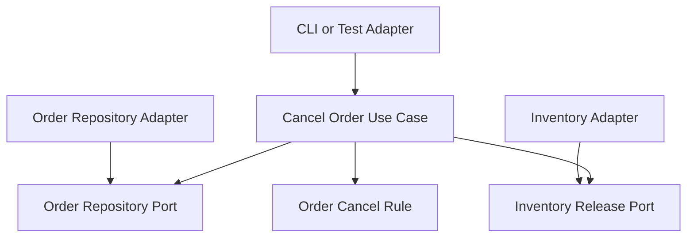

# Lesson 009: Order Cancellation And Reservation Release

## Objective

Add order cancellation before shipment and release reserved inventory through a port when cancellation succeeds.

## Theory

Forward workflow is only half of the problem.

Once the core can convert quotes, capture payment, and create shipments, it also needs a controlled reverse path for orders that have not shipped yet.

This lesson introduces:

- a cancellation rule on the order
- an application use case that orchestrates cancellation
- a port for releasing previously reserved stock

This solves the problem where inventory stays locked after an unshipped order is abandoned.

The tradeoff is one more branch in the order lifecycle and one more outbound port, but the workflow remains explicit inside the core instead of leaking into adapters.

## Why This Matters Here

Hexagonal Architecture should make both forward and reverse business workflows visible in the same place:

- the core defines the rule
- the core asks for inventory release through a port
- adapters perform the external stock update

That keeps cancellation policy testable without coupling the use case to storage details.

## Diagram

## Implementation Focus

Implement:

- `Cancelled` order status
- rejection of cancellation after shipment
- `CancelOrderUseCase`
- inventory release through a dedicated port

Deliberately leave for later:

- refund handling
- partial cancellation
- return workflows after shipment

## What To Verify

- the project compiles
- cancelling an unshipped order sets status to `Cancelled`
- cancelling an unshipped order releases reserved inventory
- cancelling a shipped order fails
