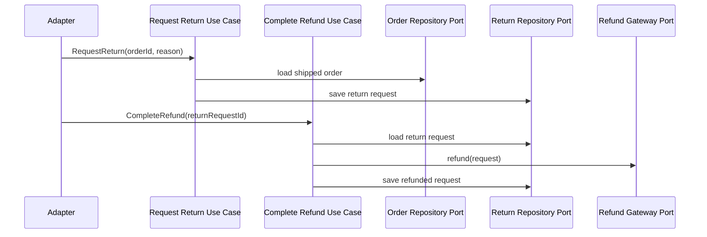

# Lesson 010: Return Request And Refund Port

## Objective

Add a post-shipment return workflow and complete refunds through an explicit port.

## Theory

Cancellation and returns are not the same thing.

Cancellation happens before shipment and releases reserved stock. Returns happen after shipment and start from what was already fulfilled.

This lesson introduces:

- a `ReturnRequest` model in the core
- a use case for requesting a return from a shipped order
- a refund gateway port for completing the money movement outside the core

This solves the problem where post-shipment correction would otherwise have no place in the hexagon except ad hoc scripts or transport handlers.

The tradeoff is another aggregate-shaped workflow plus another outbound port, but the important business decisions stay visible and testable inside the core.

## Why This Matters Here

This is the first lesson where the hexagonal workflow continues after shipment.

The core now decides:

- whether an order is eligible for return
- whether a product category blocks return
- when a refund can be attempted

The adapter still performs the actual refund side effect.

## Diagram

## Implementation Focus

Implement:

- `ReturnRequest` and return statuses
- request-return validation for shipped orders only
- a rule blocking `Clearance` products from return
- a refund completion use case through a gateway port

Deliberately leave for later:

- inventory restocking
- partial returns by line
- approval/rejection workflow
- return window policy

## What To Verify

- the project compiles
- shipped standard items can create a return request
- refund completion happens through a port
- non-shipped orders cannot be returned
- shipped clearance items cannot be returned
