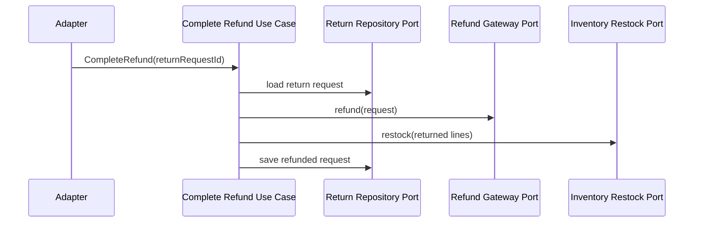

# Lesson 011: Return Restocking Port

## Objective

Restock inventory when a return is completed so post-shipment reversal affects stock as well as money.

## Theory

Lesson `010` added return requests and refund completion, but it deliberately stopped short of inventory effects.

That left an important gap:

- the business could refund the customer
- but the core had no explicit place to put returned stock back

This lesson adds that missing side effect through another outbound port.

The idea is still hexagonal:

- the core decides when restocking should happen
- the core expresses that need as a port
- the adapter performs the stock mutation

This solves the problem where accepted returns would leave inventory permanently understated after shipped goods come back.

The tradeoff is one more collaborator in the refund-completion workflow, but the compensation logic stays explicit and testable.

## Why This Matters Here

Cancellation already restores pre-shipment reservations. Returns should restore post-shipment stock.

That symmetry makes the workflow easier to reason about:

- cancel before shipment -> release reservation
- return after shipment -> restock inventory

## Diagram

## Implementation Focus

Implement:

- an inventory restock port
- refund completion that restocks returned quantities
- tests proving accepted returns restore stock

Deliberately leave for later:

- partial restocking rules
- damaged-item inspection flows
- delayed warehouse confirmation

## What To Verify

- the project compiles
- a shipped standard order can still be refunded
- refund completion restocks inventory
- non-shipped orders still cannot be returned
- clearance items still cannot be returned
