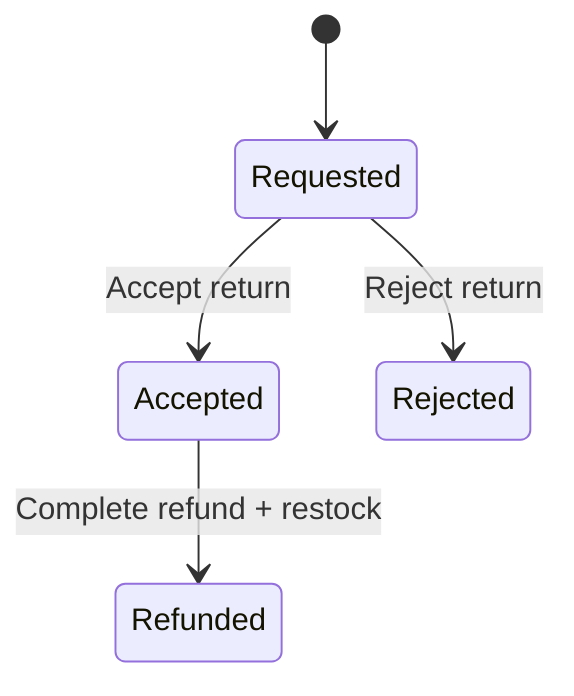

# Lesson 012: Return Review Boundary

## Objective

Insert an explicit accept-or-reject review step between requesting a return and completing the refund.

## Theory

After lesson `011`, the core can:

- request a return
- refund it
- restock inventory

That is useful, but it still collapses two different business decisions into one flow.

In the canonical workflow, a return is not automatically refundable just because it was requested. It must first be reviewed and either accepted or rejected.

This lesson introduces that review boundary inside the core.

That solves the problem where refund and restock could happen without an explicit business decision point.

The tradeoff is one more state transition and two more use cases, but the return lifecycle becomes much clearer and closer to the real workflow.

## Why This Matters Here

Hexagonal Architecture is not only about ports to infrastructure. It is also about making business workflow boundaries explicit.

The important distinction here is:

- `RequestReturn` creates a return candidate
- `AcceptReturn` or `RejectReturn` decides whether it may continue
- `CompleteRefund` is allowed only after acceptance

## Diagram

## Implementation Focus

Implement:

- accepted and rejected return states
- `AcceptReturnUseCase`
- `RejectReturnUseCase`
- a rule that blocks refund before acceptance

Deliberately leave for later:

- actor/audit fields for reviewers
- return window policy
- partial-line review decisions

## What To Verify

- the project compiles
- a requested return can be accepted and then refunded
- a requested return can be rejected
- a rejected return cannot be refunded
- stock is restocked only on the accepted-and-refunded path
