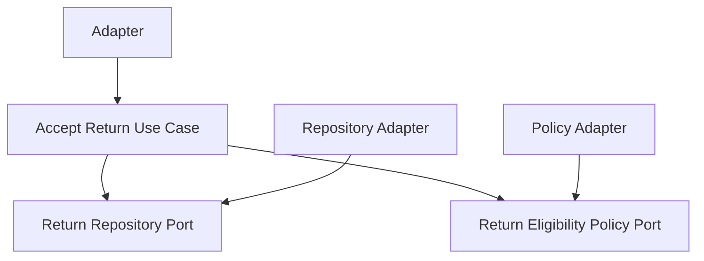

# Lesson 013: Return Eligibility Policy Port

## Objective

Require return acceptance to pass through a policy port so review is guided by business rules instead of being unconditional.

## Theory

Lesson `012` introduced the review boundary:

- returns are requested
- then accepted or rejected
- only accepted returns may be refunded

That improved the workflow, but `AcceptReturn` still approves every requested return.

This lesson adds a policy port to answer a narrower question:

- is this requested return acceptable according to the current return policy?

That keeps the decision rule outside the use case while preserving the business workflow inside the core.

The tradeoff is another collaborator, but it makes acceptance rules replaceable without turning `AcceptReturn` into a hard-coded script.

## Why This Matters Here

The canonical flow already hints at rule-based rejection, for example:

- "Outside return window"

Hexagonal Architecture should make that kind of rule visible as a ported dependency instead of burying it in handlers or repositories.

## Diagram

## Implementation Focus

Implement:

- a `ReturnEligibilityPolicy` port
- acceptance that consults the policy before changing state
- a simple adapter that rejects requests marked as outside the return window

Deliberately leave for later:

- real date-based return-window calculation
- reviewer audit fields
- partial-line eligibility rules

## What To Verify

- the project compiles
- a normal requested return can still be accepted and refunded
- a request marked as outside the return window cannot be accepted
- policy-blocked requests remain in `Requested`
- rejected returns still cannot be refunded
